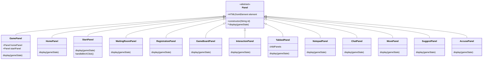

Front-end panels:

```mermaid
classDiagram
      class Panel
      <<abstract>> Panel
      Panel: +HTMLDomElement element
      Panel: +constructor(String id)
      Panel: **display(gameState)
      Panel <|-- GamePanel
      class GamePanel{
        +Panel homePanel
        +Panel startPanel
        display(gameState)
      }
      Panel <|-- HomePanel
      class HomePanel {
        display(gameState)
      }
      Panel <|-- StartPanel
      class StartPanel {
        display(gameState)
        handleBtnXClick()
      }
      Panel <|-- WaitingRoomPanel
      class WaitingRoomPanel {
        display(gameState)
      }
      Panel <|-- RegistrationPanel
      class RegistrationPanel {
        display(gameState)
      }
      Panel <|-- GameBoardPanel
      class GameBoardPanel {
        display(gameState)
      }
      Panel <|-- InteractionPanel
      class InteractionPanel {
        display(gameState)
      }
      Panel <|-- TabbedPanel
      class TabbedPanel {
        display(gameState)
        childPanels
      }
      Panel <|-- NotepadPanel
      class NotepadPanel {
        display(gameState)
      }
      Panel <|-- ChatPanel
      class ChatPanel {
        display(gameState)
      }
      Panel <|-- MovePanel
      class MovePanel {
        display(gameState)
      }
      Panel <|-- SuggestPanel
      class SuggestPanel {
        display(gameState)
      }
      Panel <|-- AccusePanel
      class AccusePanel {
        display(gameState)
      }
```
