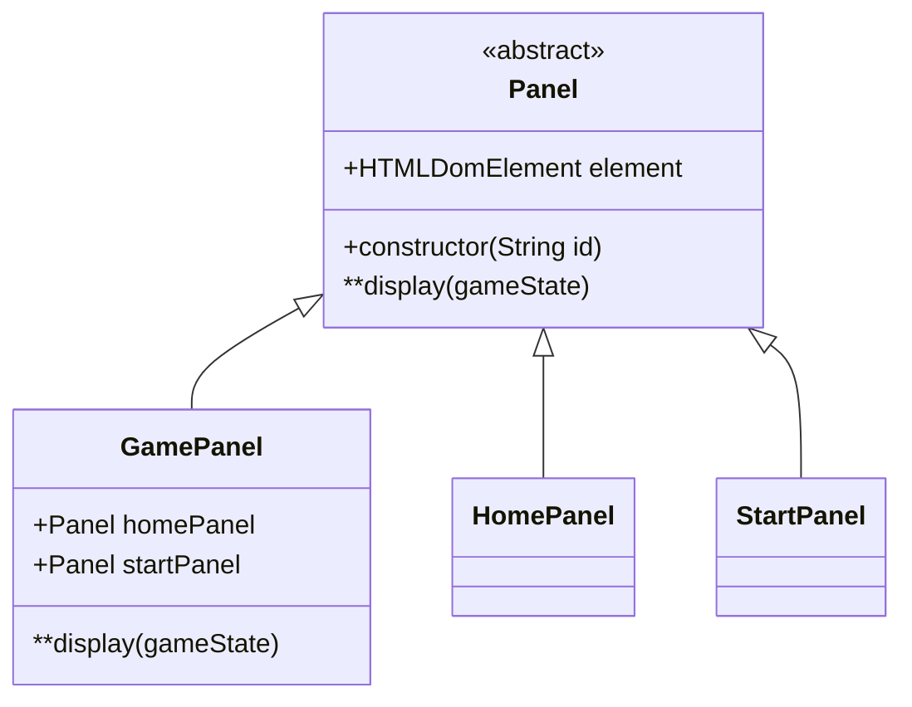

Front-end panels:

```mermaid
classDiagram
      class Panel
      <<abstract>> Panel
      Panel: +HTMLDomElement element
      Panel: +constructor(String id)
      Panel: **display(gameState)
      Panel <|-- GamePanel
      Panel <|-- HomePanel
      Panel <|-- StartPanel
      class GamePanel{
          +Panel homePanel
          +Panel startPanel
          **display(gameState)
      }
```
