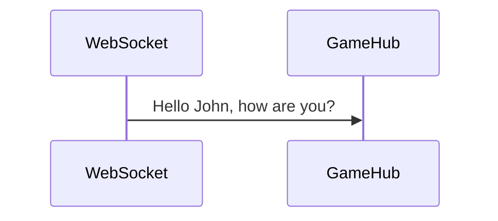
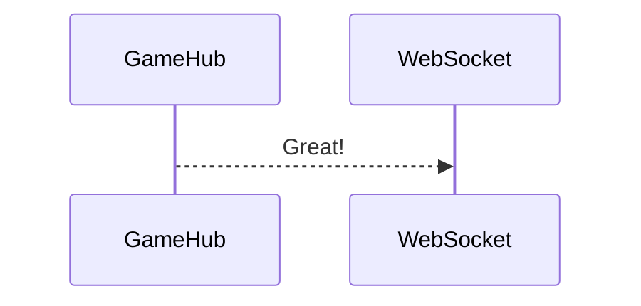

# Client Side Design

```mermaid
classDiagram
      class Panel
      <<abstract>> Panel
      Panel: +HTMLDomElement element
      Panel: +constructor(String id)
      Panel: **display(gameState)
      Panel <|-- GamePanel
      class GamePanel{
        -HomePanel homePanel
        -StartPanel startPanel
        -WaitingRoomPanel waitingRoomPanel
        -RegistrationPanel registrationPanel
        -GameBoardPanel gameboardPanel
        -InteractionPanel interactionPanel
        +display(gameState)
        +showScreen1()
        +showScreen2()
        +showScreen3()
      }
      Panel <|-- HomePanel
      class HomePanel {
        display(gameState)
      }
      Panel <|-- StartPanel
      class StartPanel {
        display(gameState)
        handleBtnCreateGameClick()
        handleBtnJoinGameClick()
      }
      Panel <|-- WaitingRoomPanel
      class WaitingRoomPanel {
        display(gameState)
      }
      Panel <|-- RegistrationPanel
      class RegistrationPanel {
        display(gameState)
        handleCharacterClick()
        handleBtnRegisterClick()
        handleBtnStartGameClick()
      }
      Panel <|-- GameBoardPanel
      class GameBoardPanel {
        display(gameState)
      }
      Panel <|-- InteractionPanel
      class InteractionPanel {
        display(gameState)
        TabbedPanel topPanel
        TabbedPanel bottomPanel
      }
      Panel <|-- TabbedPanel
      class TabbedPanel {
        display(gameState)
        List<Panel> childPanels
      }
      Panel <|-- NotepadPanel
      class NotepadPanel {
        display(gameState)
      }
      Panel <|-- ChatPanel
      class ChatPanel {
        display(gameState)
        handleBtnSendClick()
      }
      Panel <|-- MovePanel
      class MovePanel {
        display(gameState)
        handleDirectionalClick()
        handleBtnMoveClick()
      }
      Panel <|-- SuggestPanel
      class SuggestPanel {
        display(gameState)
        handleBtnSuggestClick()
      }
      Panel <|-- AccusePanel
      class AccusePanel {
        display(gameState)
        handleBtnAccuseClick()
      }
      class Player {
        bool disqualified
        int character
      }
      class GameState {
        List<Player> players
        Player currentPlayer
        int witnessItem_character
        int witnessItem_room
        int witnessItem_weapon
      }
      class GameHub {
        +GameState gameState
        +GamePanel gamePanel
        -receiveMessage(Map message)
        -sendMessage(Map message)
      }
```

# Sequence Diagrams

## Receive message

```mermaid
sequenceDiagram
    WebSocket->>GameHub: Hello John, how are you?
```

## Send Message

```mermaid
sequenceDiagram
    GameHub-->>WebSocket: Great!
```